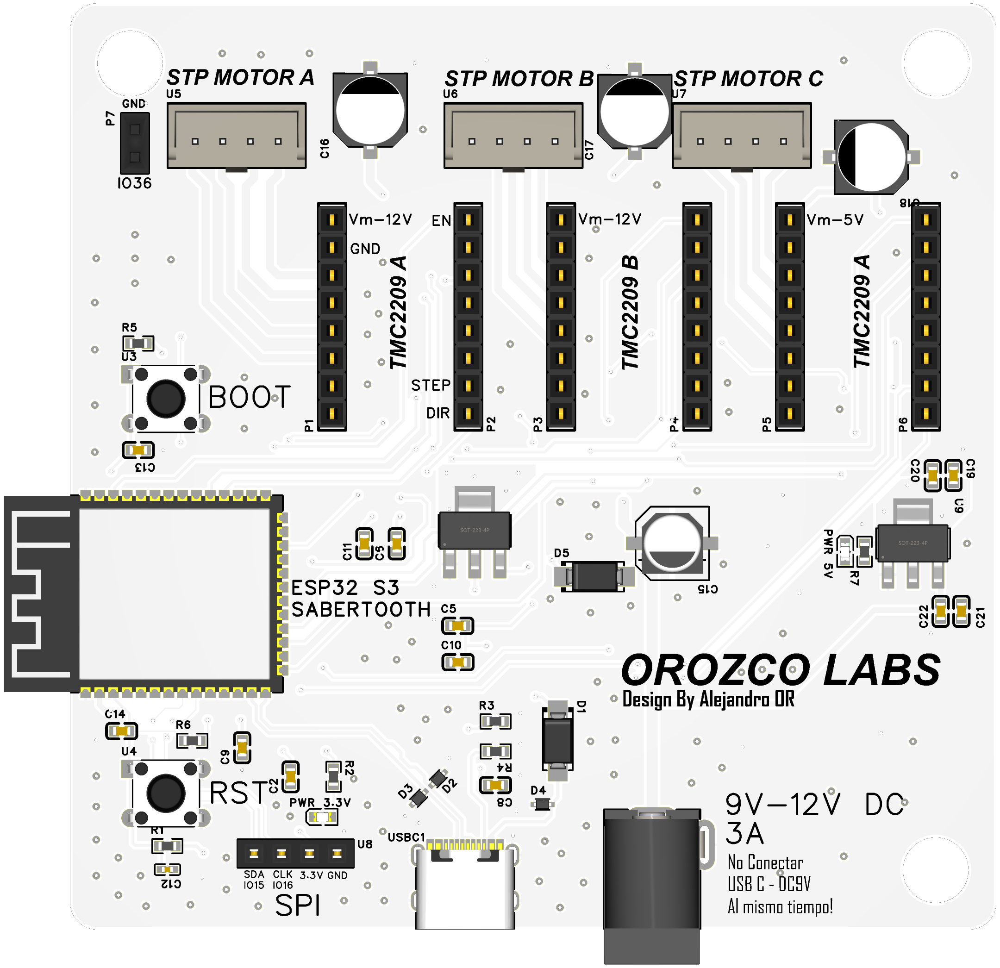

| Chips Soportados | ESP32 | ESP32-C2 | ESP32-C3 | ESP32-C6 | ESP32-H2 | ESP32-S3 |
| ----------------- | ----- | -------- | -------- | -------- | -------- | -------- |

# Programa para el control del cortados de fibras

Este programa permite que la placa personalizada sabertooth ESP32 S3, controle dos motores a pasos, correspondiendo uno al corte y otro al estiramiento respectivamente.

El programa está diseñado para utilizar los dos núcleos del ESP32, uno encargado de correr las tareas del BLE, establecer conexiones, enviar-recibir características, etc. Mientras que el otro núcleo se encarga de operar los motores a paso, mediante dos drivers TCM2209 además de detectar finales de carrera para calcular la distancia y como medida de seguridad.

A continuación, se presenta informacion importante del programa, además es posible verificar el manual [aquí.](misc/DiagramaPlacaDeDesarrolloESP32.pdf)

### Hardware Permitido

* La opcion recomendable para implementar el sistema es en la plataforma de desarrollo Sabertooth ESP32 S3, el cual esta a disposicion del capitulo IEEE photonics, pero si se requiriera la instalacion en otra plataforma, este programa es compatible con chips: ESP32 S3, C3, C2, C6, H2.




## Archivos

Para lograr actualizar o anadir mas funcionalidades al sistema se debe de editar el archivo principal:

```
\main\main.c
```

Mientras que para anadir funciones de impplementacion, puede editar el archivo c y de cabeceras:
```
main/motores.c
main/motores.h
```
<!-- ### Build and Flash

Run `idf.py -p PORT flash monitor` to build, flash and monitor the project.

(To exit the serial monitor, type ``Ctrl-]``.)

See the [Getting Started Guide](https://idf.espressif.com/) for full steps to configure and use ESP-IDF to build projects. -->
## Estado Inicial

Para un correcto uso del dispositivo y para tener una optima calibracion se debe se ajustar manualmente las siguientes partes moviles del dispositivo:

### Movil de corte

Asegurarse mediante un caliper o vernier que la distancia entre la seja de la parte movil y el chasis del motor a pasos es de 8.6 mm, mirar la figura de a continuacion:


### Plataforma de estiramiento

Asegurarse que el movil de estiramiento esta al tope del mecanismo, esto con ayuda del la perilla de ajuste, mirar la figura de a continuacion:


## Alimentacion

Asegurarse que la alimentacion se por medio del Jack de alimentacion, ademas de suministrar 9V DC con una corriente operativa de 3 ampers.

<!-- ## Aplicacion de control

### Seleccion de dispositivo:

### Rutina de corte

### Corte manual -->

## Proteccion de tope

Pese a que la aplicacion de control delimita la distancias de corte y estiramiento del dispositivo, es posible que sucedan algunos de los siguetes resultados:

### Movil de corte choca con cilindro central

Si la navaja de corte chocara con el cilindro de corte, es necesario que mediante la aplicacion se devuelva a su estado inicial o cero, posteriromente, se debe de mover manualmente a su posicion inicial de 8.6 mm, como se explica en la seccion de "Estado inicial".

### Movil de estiramiento llega al final

Si por alguna razon el movil de estiramiento llegara al limite, por cualquier situacion, el sistema se parara en cuanto llegue al tope, en esta situacion se debe de mover a la posicion inicial del movil de estirmaiento manualmente, posteriormente se debera de recalibrar el sistema.

## Troubleshooting

Para cualquir consulta o sugerencia, puede contactarse mediante el correo institucional a.orozco.ramirez@ugto.mx
